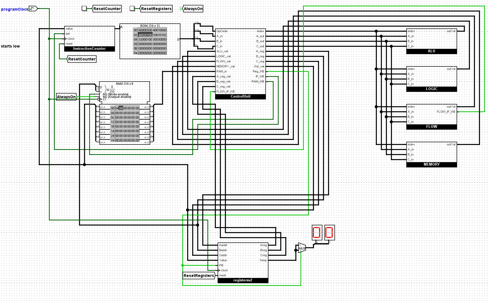

# SimpleISA

A custom instruction set with an assembler, disassembler, emulator, and a Logisim CPU that runs it.

## What's here

- **ISALib** (`toolchain/ISALib`): a .NET class library containing all the definitions from the ISA spec implemented in code, shared by the assembler, disassembler, emulator, and other tools.
- **Assembler** (`toolchain/Assembler`): two-pass assembler with label support, turns assembly files (`.asm`) files into machine code.
- **Disassembler** (`toolchain/Disassembler`): turns machine code back into readable assembly for debugging.
- **Emulator** (`toolchain/Emulator`): runs the machine code in software. Written in C#, with registers, RAM, and basic I/O.
- **Logisim CPU** (`logisim/logisim/SimpleCPU.circ`): a gate-level CPU that executes the assembled bytecode in hardware.
- **Spec** (`spec/`): the full instruction and register definitions as CSV.
- **Example programs** (`toolchain/Assembler/TestData/`): small assembly programs that exercise the ISA.

## The ISA

- 32-bit fixed-length instructions: `[OPCODE | PARAM1 | PARAM2 | PARAM3]`, one byte each.
- 32 registers, including special-purpose ones for the instruction pointer, flags, char I/O, and random number generation.
- ~30 instructions covering math, logic, memory, control flow, and I/O. Full list in `spec/isa-instructions.csv`.

## The hardware

The CPU built in Logisim is an 8-bit machine:

- 8 general-purpose registers of 8 bits each, all zero at start.
- An 8-bit instruction pointer, supporting programs up to 256 instructions long.
- RAM with `LOAD`/`STR` for memory access.

Here it is running the `count_to_five` program (`logisim/example bytecode/count_to_five`), counting up to five in a register and looping:



And the full layout:


### Instructions implemented in hardware

| Category | Instruction | Opcode | Notes |
|----------|-------------|--------|-------|
| — | `NONE` | `0x00` | No-op |
| Math | `ADD` | `0x10` | |
| Math | `SUB` | `0x11` | |
| Math | `MULT` | `0x12` | |
| Math | `DIV` | `0x13` | |
| Math | `LSHF` | `0x14` | Left shift by a single bit (in the ALU) |
| Math | `RSHF` | `0x15` | Right shift by a single bit (in the ALU) |
| Math | `GTHAN` | `0x16` | Greater-than compare |
| Math | `EQ` | `0x17` | Equality compare |
| Math | `LTHAN` | `0x18` | Less-than compare |
| Logic | `NOT` | `0x20` | |
| Logic | `AND` | `0x21` | |
| Logic | `OR` | `0x22` | |
| Logic | `NOR` | `0x23` | |
| Logic | `NAND` | `0x24` | |
| Logic | `XOR` | `0x25` | |
| Logic | `RSHFVAR` | `0x26` | Right shift by a register value (more than a single bit) |
| Flow | `JMP` | `0x30` | Unconditional jump |
| Flow | `JMPZ` | `0x31` | Jump if register is zero |
| Flow | `JMPEQ` | `0x32` | Jump if two registers are equal |
| Memory | `SET` | `0x40` | Set register to immediate value |
| Memory | `MOV` | `0x41` | Copy register to register |
| Memory | `LOAD` | `0x42` | Load from RAM into register |
| Memory | `STR` | `0x43` | Store register into RAM |

The rest of the spec (`PRNT`, `READ`, `RNDM`, `INC`, `DEC`, `SETBIT`, `CLRBIT`, ...) is implemented in the software emulator only.

## Demo: Rock Paper Scissors

A full Rock Paper Scissors game written in SimpleISA assembly (`toolchain/Assembler/TestData/RockPaperScissors.asm`). It reads user input with `READ`, branches with `JMPZ`, and prints results with `PRNT`.

## Example programs

In `toolchain/Assembler/TestData/`:

- **CountToFive.asm** — counts to five with `ADD`/`JMPEQ`; the software twin of the program the Logisim CPU runs in the gif above.
- **Fibonacci.asm** — computes Fibonacci numbers with `ADD`, `MOV`, `GTHAN`, and `JMPZ`.
- **MemorySwap.asm** — swaps two registers through RAM with `STR`/`LOAD`.
- **PrintDigits.asm** — prints `12345` to the console using the `CHAR` register and `PRNT` (emulator only).
- **RockPaperScissors.asm** — the full game.

Hardware-ready Logisim RAM images of the examples that only use hardware instructions (`count_to_five`, `fibonacci`, `memory_swap`) live in `logisim/example bytecode/` — load one into the CPU's program RAM in Logisim to run it.

## Getting started

Requires the .NET 8.0 SDK.

```bash
dotnet build toolchain/ISA.sln
```

Assemble a program and run it in the emulator:

```bash
dotnet run --project toolchain/Assembler -- toolchain/Assembler/TestData/PrintDigits.asm out.bin
dotnet run --project toolchain/Emulator -- out.bin
```

The Logisim CPU opens in [Logisim Evolution](https://github.com/logisim-evolution/logisim-evolution).

