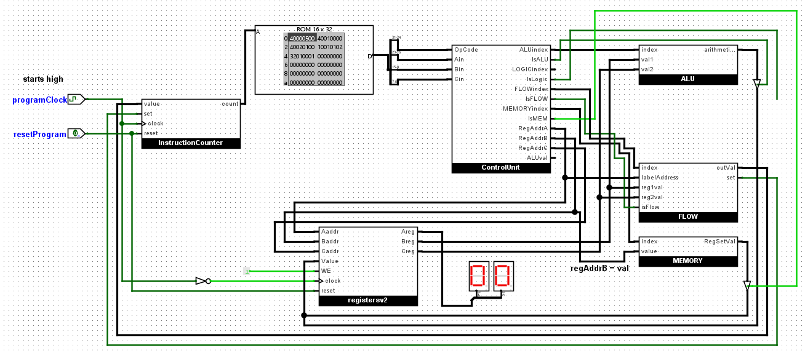
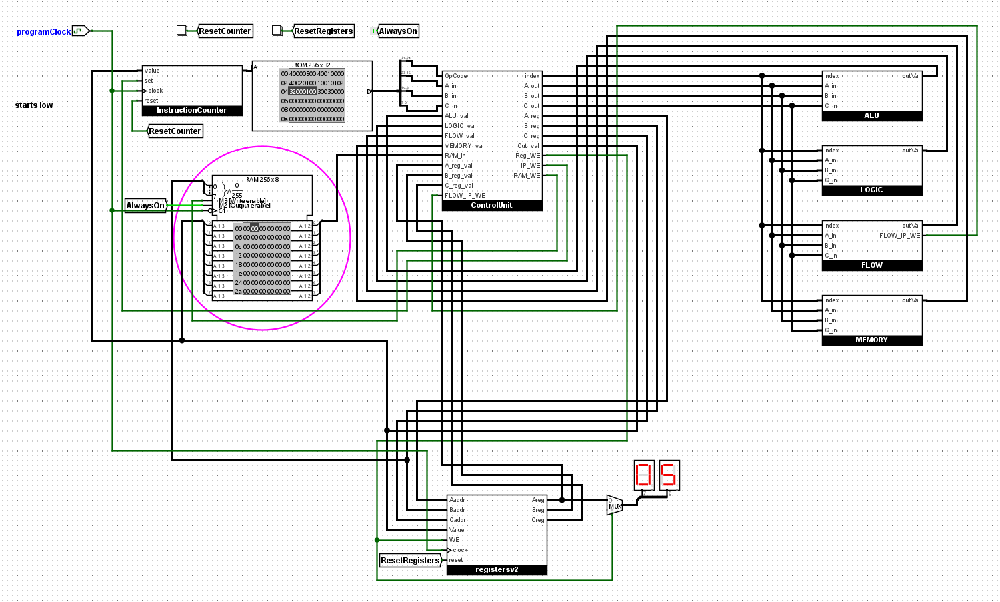

# Full-Stack 8-Bit CPU

An 8-bit CPU designed from the gates up: built in Logisim, with its arithmetic core rebuilt physically on a breadboard with real ICs. Around the CPU is the full stack needed to program it: a custom instruction set (SimpleISA), a two-pass assembler, a disassembler, and a software emulator that serves as the reference implementation for the hardware.

**The pipeline: toolchain to simulation to silicon.** Write assembly, assemble it to bytecode, verify behavior in the emulator, then run the same bytecode on the gate-level CPU.

## What's here

- **ISALib** (`toolchain/ISALib`): a .NET class library containing all the definitions from the ISA spec implemented in code, shared by the assembler, disassembler, emulator, and other tools.
- **Assembler** (`toolchain/Assembler`): two-pass assembler with label support, turns assembly files (`.asm`) files into machine code.
- **Disassembler** (`toolchain/Disassembler`): turns machine code back into readable assembly for debugging.
- **Emulator** (`toolchain/Emulator`): runs the machine code in software. Written in C#, with registers, RAM, and basic I/O.
- **Logisim CPU** (`logisim/logisim_full/SimpleCPU.circ`): a gate-level CPU that executes the assembled bytecode in hardware.
- **Logisim mini ALU** (`logisim/logisim_small/simplercpu.circ`): a heavily reduced version of the CPU's ALU, simple enough to build physically on a breadboard.
- **Spec** (`spec/`): the full instruction and register definitions as CSV.
- **Example programs** (`toolchain/Assembler/TestData/`): small assembly programs that exercise the ISA.

## The ISA

- 32-bit fixed-length instructions: `[OPCODE | PARAM1 | PARAM2 | PARAM3]`, one byte each.
- 32 registers, including special-purpose ones for the instruction pointer, flags, char I/O, and random number generation.
- ~30 instructions covering math, logic, memory, control flow, and I/O. Full list in `spec/isa-instructions.csv`.

## The hardware

The CPU built in Logisim is an 8-bit machine:

- 8 general-purpose registers of 8 bits each, all zero at start.
- An 8-bit instruction pointer, supporting programs up to 256 instructions long.
- RAM with `LOAD`/`STR` for memory access.

Here it is running the `count_to_five` program (`logisim/example bytecode/count_to_five`), counting up to five in a register and looping:


### Redesigning the CPU: v1 → v2

I redid the CPU in Logisim for a more accurate representation of a real CPU: a centralized control unit handles all the signals within a single clock tick and does the manual routing, with far fewer unnecessary control buffers, which also made RAM easy to implement. The v2 layout is an extensible base for the stack and function-calling features listed in [What's next](#whats-next).

| v1 | v2 (current) |
|----|--------------|
|  |  |

### Instructions implemented in hardware

| Category | Instruction | Opcode | Notes |
|----------|-------------|--------|-------|
| `NONE` | `NONE` | `0x00` | No-op |
| Math | `ADD` | `0x10` | |
| Math | `SUB` | `0x11` | |
| Math | `MULT` | `0x12` | |
| Math | `DIV` | `0x13` | |
| Math | `LSHF` | `0x14` | Left shift by a single bit (in the ALU) |
| Math | `RSHF` | `0x15` | Right shift by a single bit (in the ALU) |
| Math | `GTHAN` | `0x16` | Greater-than compare |
| Math | `EQ` | `0x17` | Equality compare |
| Math | `LTHAN` | `0x18` | Less-than compare |
| Logic | `NOT` | `0x20` | |
| Logic | `AND` | `0x21` | |
| Logic | `OR` | `0x22` | |
| Logic | `NOR` | `0x23` | |
| Logic | `NAND` | `0x24` | |
| Logic | `XOR` | `0x25` | |
| Logic | `RSHFVAR` | `0x26` | Right shift by a register value (more than a single bit) |
| Flow | `JMP` | `0x30` | Unconditional jump |
| Flow | `JMPZ` | `0x31` | Jump if register is zero |
| Flow | `JMPEQ` | `0x32` | Jump if two registers are equal |
| Memory | `SET` | `0x40` | Set register to immediate value |
| Memory | `MOV` | `0x41` | Copy register to register |
| Memory | `LOAD` | `0x42` | Load from RAM into register |
| Memory | `STR` | `0x43` | Store register into RAM |

The rest of the spec (`PRNT`, `READ`, `RNDM`, `INC`, `DEC`, `SETBIT`, `CLRBIT`, ...) is implemented in the software emulator only.

### From simulation to breadboard

I also wrote a significantly reduced version of the CPU (`logisim/logisim_small/simplercpu.circ`): just the arithmetic core, which performs basic `ADD`/`SUB` operations by reading from ROM and running the values through a multiplexer, a full adder, and an XOR IC. Keeping it down to those few components meant it could be built physically with real ICs on a breadboard — here it is built out and running:

| The physical build | Working |
|--------------------|---------|
|  |  |

Parts used (datasheets linked):

- [AT28C256](https://ww1.microchip.com/downloads/en/DeviceDoc/doc0006.pdf) — 32K×8 parallel EEPROM, the ROM holding the program.
- [SN74LS173A](https://www.ti.com/lit/ds/symlink/sn74ls173a.pdf) — 4-bit D-type register.
- [SN74LS283](https://www.ti.com/lit/ds/symlink/sn74ls283.pdf) — 4-bit binary full adder with fast carry.
- [SN74LS86A](https://mm.digikey.com/Volume0/opasdata/d220001/medias/docus/2380/SN54%2C74%28LS%2CS%2986%28A%29.pdf) — quad 2-input XOR gate.
- [SN74LS157](https://www.ti.com/lit/ds/symlink/sn74ls157.pdf) — quad 2-to-1 multiplexer.
- [SN74LS04](https://www.ti.com/lit/ds/symlink/sn74ls04.pdf) — hex inverter.

### Lessons learned debugging the CPU

- **Isolate the faulty instruction.** When the CPU crashed on a certain instruction, being able to run that instruction in isolation made it significantly easier to debug.
- **Have registers write on the falling edge of the clock.** The CPU initially wrote registers on the rising edge, which caused a pretty severe problem: values raced through the datapath within a single tick. Writing on the falling edge gives the ALU and control signals the first half of the cycle to settle.

## Demo: Rock Paper Scissors

A full Rock Paper Scissors game written in SimpleISA assembly (`toolchain/Assembler/TestData/RockPaperScissors.asm`). It reads user input with `READ`, branches with `JMPZ`, and prints results with `PRNT`.

## Example programs

In `toolchain/Assembler/TestData/`:

- **CountToFive.asm** - counts to five with `ADD`/`JMPEQ`; the software twin of the program the Logisim CPU runs in the gif above.
- **Fibonacci.asm** — computes Fibonacci numbers with `ADD`, `MOV`, `GTHAN`, and `JMPZ`.
- **MemorySwap.asm** — swaps two registers through RAM with `STR`/`LOAD`.
- **PrintDigits.asm** — prints `12345` to the console using the `CHAR` register and `PRNT` (emulator only).
- **RockPaperScissors.asm** — the full game.

Hardware-ready Logisim RAM images of the examples that only use hardware instructions (`count_to_five`, `fibonacci`, `memory_swap`) live in `logisim/example bytecode/`, so load one into the CPU's program RAM in Logisim to run it.

## What's next

Building on the v2 layout:

- `PUSH` and `POP` instructions.
- A dedicated stack pointer (`SP`) register.
- Stack frames and full function calling.
- Indirect addressing for all instructions.

## Getting started

Requires the .NET 8.0 SDK.

```bash
dotnet build toolchain/ISA.sln
```

Assemble a program and run it in the emulator:

```bash
dotnet run --project toolchain/Assembler -- toolchain/Assembler/TestData/PrintDigits.asm out.bin
dotnet run --project toolchain/Emulator -- out.bin
```

The Logisim CPU opens in [Logisim Evolution](https://github.com/logisim-evolution/logisim-evolution).